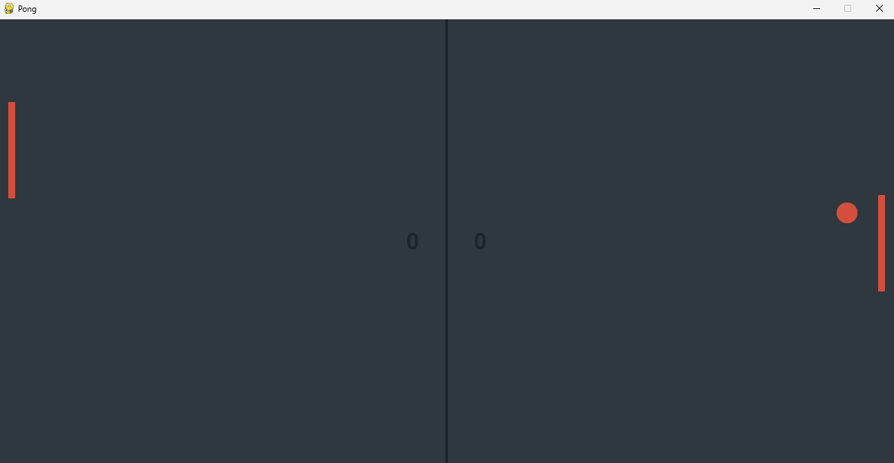
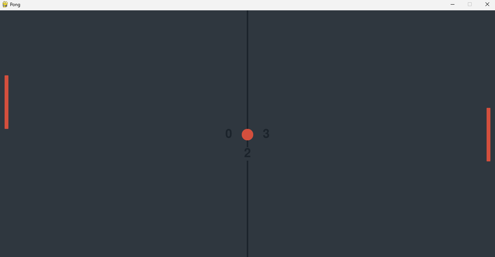
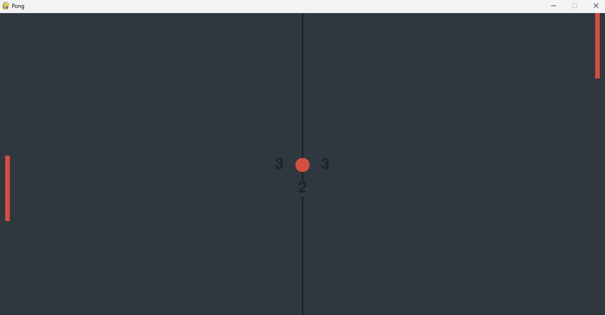

# Pong

A modern implementation of the classic **Pong** arcade game built with **Python** and **Pygame**. This project features an object-oriented architecture, sprite-based collision detection, AI opponent, sound effects, score tracking, and a clean, maintainable codebase.

> **Repository Structure**
>
> This repository contains three independent branches:
>
> * **desktop** *(default)* — Native Windows/Desktop version
> * **web** — Browser version built with `pygbag`
> * **android** — Android version *(currently in development)*

---

## Features

* 🏓 Classic Pong gameplay
* 🤖 AI-controlled opponent
* 🎮 Smooth paddle controls
* 💥 Sprite-based collision detection
* 🔊 Sound effects
* ⏱️ Countdown before each serve
* 📊 Live score tracking
* 🧱 Object-oriented architecture
* ⚡ 120 FPS gameplay

---

## Requirements

* Python 3.10+
* Pygame-ce

Install the required dependency:

```bash
pip install -r requirements.txt
```

or

```bash
pip install pygame-ce
```

---

## Running the Game

From the project directory:

```bash
python main.py
```

---

## Controls

| Key | Action           |
| --- | ---------------- |
| ↑   | Move paddle up   |
| ↓   | Move paddle down |

---

## Building the Executable

This project includes a **PyInstaller** specification file.

Build using:

```bash
pyinstaller Pong.spec
```

Or generate a new build manually:

```bash
pyinstaller --onefile --windowed main.py
```

The executable will be created inside:

```text
dist/
```

---

## Project Structure

```text
Pong
│
├── assets/
│   ├── Ball.png
│   ├── Paddle.png
│   ├── pong.ogg
│   └── score.ogg
│
├── screenshots/
│
├── main.py
├── main.spec
├── requirements.txt
├── README.md
└── .gitignore
```

---

## Screenshots





---

## Branches

This repository hosts multiple platform-specific versions of the game.

| Branch      | Description                             |
| ----------- | --------------------------------------- |
| **desktop** | Native desktop version for Windows, macOS, and Linux (default branch) |
| **web**     | Browser version built using `pygbag`      |
| **android** | Android version *(work in progress)*    |

Each branch evolves independently and has its own:

* README
* Assets
* Features
* GitHub Actions
* Release builds
* Commit history

---

## Technologies Used

* Python
* Pygame
* PyInstaller
* Git
* GitHub Actions

---

## License

This project is released under the [MIT License](LICENSE).

---

## Author

**Shivam Kumar**
